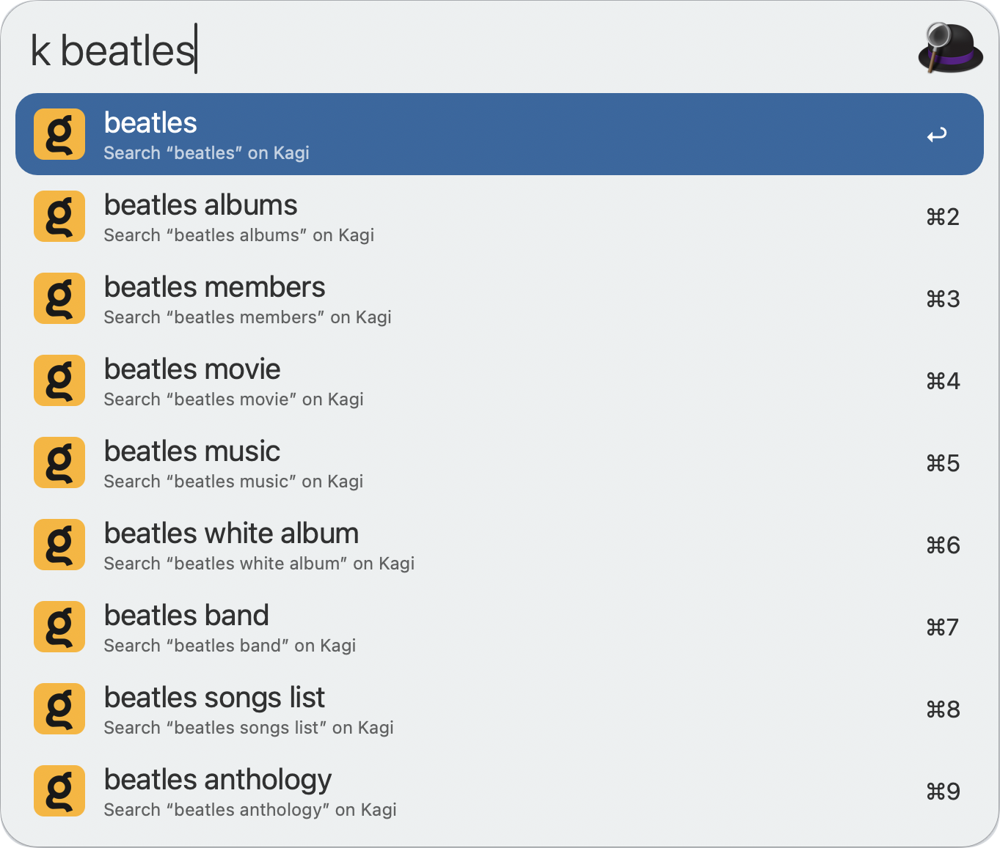

#  Kagi Suggest Alfred Workflow

Get in-line Kagi search suggestions

<!--[⤓ Install on the Alfred Gallery](https://alfred.app/workflows/alfredapp/google-suggest)-->

## Usage

Get in-line suggestions from Kagi’s search results via the `k` keyword. Press <kbd>↩&#xFE0E;</kbd> to open the search results page in the default web browser.

Set a Session Link to search in the [Workflow’s Configuration](https://www.alfredapp.com/help/workflows/user-configuration/).
